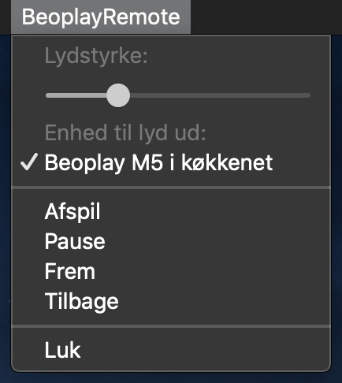

# BeoplayRemoteGUI.app

This is an unofficial menu bar app for Mac OS to remote control network enabled Beoplay loudspeakers.

## Example



The menu bar has basic support for play/pause, forward/backward (fx for shuffling between favourite radio stations). The volume level can be adjusted and works well with volume adjustments made directly on the loudspeakers, through the original Bang&Olufsen iOS app, Spotify, etc. Speakers are automatically discovered via Bonjour.

## Installation
```
$ make install
xcodebuild [..]
rm -rf /Applications/BeoplayRemoteGUI.app
cp -rp Release.xcarchive/Products/Applications/BeoplayRemoteGUI.app /Applications
$
```

## Related
This application depends on the RemoteCore library from https://github.com/tlk/beoplay-macos-remote-cli.
