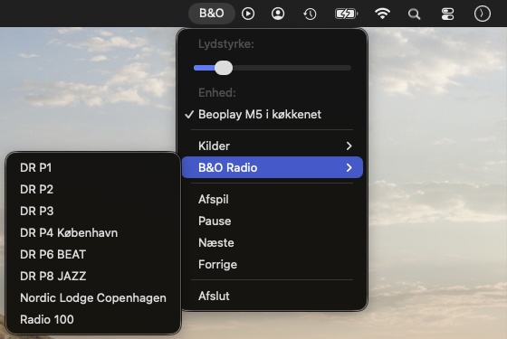

# Beoplay Remote for macOS

This is an unofficial app to remote control network enabled [Bang & Olufsen](https://www.bang-olufsen.com/) loudspeakers from macOS.



The menu bar app has basic support for play/pause and forward/backward. The volume level can be adjusted and works well with volume adjustments made directly on the loudspeakers, through the original B&O iOS app, Spotify and Deezer. Speakers are automatically discovered via Bonjour. TuneIn favorite radio stations are fetched from the device and can be changed via [hotkeys](Configuration.md#hotkeys--keyboard-shortcuts).


Apple keyboards features <kbd>volume-down</kbd> and <kbd>volume-up</kbd> keys to control the volume of the local speakers. When the same physical keys function as <kbd>F11</kbd> and <kbd>F12</kbd> keys they can control the volume of the remote speakers via this application.

| Local speakers           | Remote speakers                        |
| ------------------------ | -------------------------------------- |
| <kbd>volume-down</kbd>   | <kbd>fn</kbd> + <kbd>volume-down</kbd> |
| <kbd>volume-up</kbd>     | <kbd>fn</kbd> + <kbd>volume-up</kbd>   |


## Installation

Download the latest release and follow the instructions here:
* https://github.com/tlk/beoplay-macos-remote-gui/releases

Alternatively, install with Homebrew:

```
brew install tlk/beoplayremote/beoplayremotegui --no-quarantine
```

Please see [Configuration.md](Configuration.md) for optional settings and how to deal with existing hotkey bindings.


## Build from source
```
$ xcodebuild -version
Xcode 12.3
Build version 12C33

$ make install
xcodebuild [..]
rm -rf /Applications/BeoplayRemoteGUI.app
cp -rp Release.xcarchive/Products/Applications/BeoplayRemoteGUI.app /Applications
$
```


## Read more

* See the [beoplay-cli](https://github.com/tlk/beoplay-macos-remote-cli) for a command line interface
* [How do I control the volume in spotify with the volume buttons on my apple keyboard?](https://community.spotify.com/t5/Desktop-Mac/How-do-I-control-the-volume-in-spotify-with-the-volume-buttons/m-p/4726068) (Spotify Community)
* [Beoplay Remote for macOS (PoC)](https://forum.beoworld.org/forums/t/37724.aspx) (BeoWorld)
* [Apple HomeKit](https://en.wikipedia.org/wiki/HomeKit) integration via [Homebridge plugin for Bang & Olufsen/Beoplay devices](https://github.com/connectjunkie/homebridge-beoplay)
* How to [run the official B&O iOS applications on Apple computers with the "M1" processor](https://www.theverge.com/2020/11/18/21574207/how-to-install-run-any-iphone-ipad-app-m1-mac)
