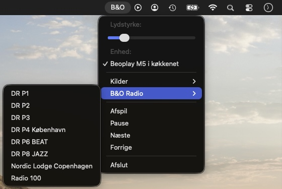

# Beoplay Remote for macOS

This is an unofficial app to remote control network enabled [Bang & Olufsen](https://www.bang-olufsen.com/) Beoplay loudspeakers from macOS.



This app can be used to adjust the sound volume on connected speakers and to control music playback and radio stations. It works well with the original B&O iOS app and other connected apps such as Spotify and Deezer. Your speakers are automatically discovered on the local network via Bonjour. B&O Radio favorite stations are fetched from the device..


Apple keyboards features <kbd>volume-down</kbd> and <kbd>volume-up</kbd> keys to control the volume of the local speakers. When the same physical keys function as <kbd>F11</kbd> and <kbd>F12</kbd> keys they can be used to control the volume of remote Beoplay speakers via this application. You can read more about this in the [hotkeys](Configuration.md#hotkeys--keyboard-shortcuts) (shortcut) section.

| Local speakers           | Remote Beoplay speakers                        |
| ------------------------ | -------------------------------------- |
| <kbd>volume-down</kbd>   | <kbd>fn</kbd> + <kbd>volume-down</kbd> |
| <kbd>volume-up</kbd>     | <kbd>fn</kbd> + <kbd>volume-up</kbd>   |


## Installation

Get the latest release and follow the installation instructions:
> [Download BeoplayRemoteGUI.dmg](https://github.com/tlk/beoplay-macos-remote-gui/releases/latest)

Alternatively, you can install it with Homebrew:
```
brew install tlk/beoplayremote/beoplayremotegui --no-quarantine
```

Please see [Configuration.md](Configuration.md) on how to setup hotkey bindings.


## Build from source

If you have Xcode you can build and install from source:
```
$ xcodebuild -version
Xcode 13.2.1
Build version 13C100

$ make install
xcodebuild [..]
rm -rf /Applications/BeoplayRemoteGUI.app
cp -rp Release.xcarchive/Products/Applications/BeoplayRemoteGUI.app /Applications
$
```


## Read more

* See the [beoplay-cli](https://github.com/tlk/beoplay-macos-remote-cli) for a command line interface
* [How do I control the volume in spotify with the volume buttons on my apple keyboard?](https://community.spotify.com/t5/Desktop-Mac/How-do-I-control-the-volume-in-spotify-with-the-volume-buttons/m-p/4726068) (Spotify Community)
* [Beoplay Remote for macOS (PoC)](https://forum.beoworld.org/forums/t/37724.aspx) (BeoWorld)
* [Apple HomeKit](https://en.wikipedia.org/wiki/HomeKit) integration via [Homebridge plugin for Bang & Olufsen/Beoplay devices](https://github.com/connectjunkie/homebridge-beoplay)
* How to [run the official B&O iOS applications on Apple computers with the "M1" processor](https://www.theverge.com/2020/11/18/21574207/how-to-install-run-any-iphone-ipad-app-m1-mac)
